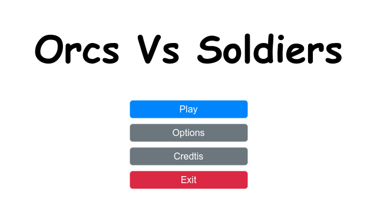
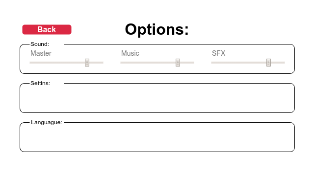
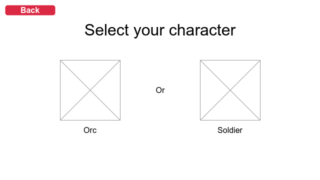
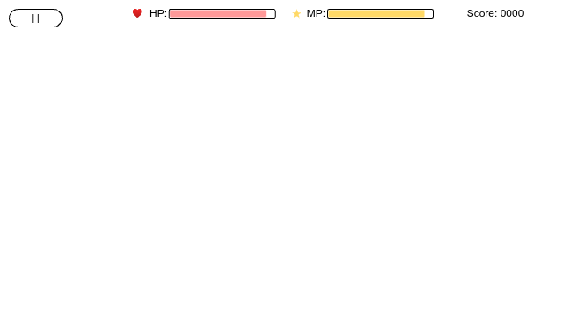
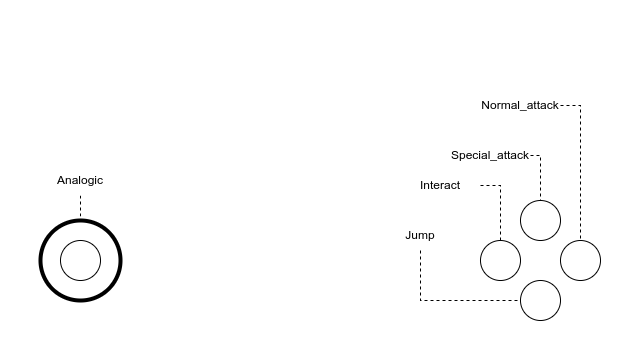
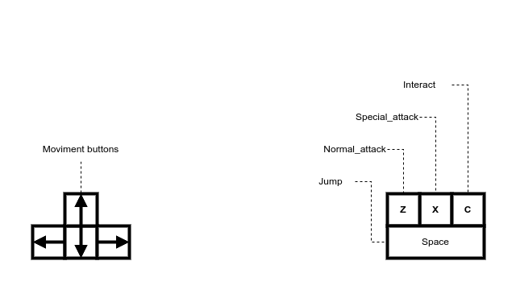

# Project New Horizon

*Game Design Document* (GDD) versão Portguês do Brasil

## Índice

- [1. Informações Gerais](#1-informações-gerais-voltar)
  - [1.1. Titulo do jogo](#11-título-do-jogo-voltar)
  - [1.2. Plataformas](#12-plataformas-voltar)
  - [1.3. Gênero](#13-gênero-voltar)
  - [1.4. Público alvo](#14-público-alvo-voltar)
  - [1.5. Visão geral do jogo](#15-visão-geral-do-jogo-voltar)
- [2. Engenharia de Software](#2-engenharia-de-software-voltar)
  - [2.1. Levantamento de Requisitos]()
    - [2.1.1. Requisitos Funcionais]()
    - [2.1.2. Requisitos Não-Funcionais]()
  - [2.2. Organização do Projeto](#22-organização-do-projeto-voltar)
  - [2.3. Diagramas UML](#23-diagramas-uml-voltar)
  - [2.4. Fluxograma](#24-fluxogramas-voltar)
  - [2.5. Protótipos de tela](#25-protótipos-de-tela-voltar)
- [3. Conclusão](#3-conclusão-voltar)
- [4. Recursos Utilizados](#4-recursos-utilizados-voltar)
  - [Ferramentas de desenvolvimento](#ferramentas-de-desenvolvimento-voltar)
  - [Assets](#assets-voltar)

## 1. Informações Gerais [[Voltar]](#índice)

### 1.1. Título do jogo [[Voltar]](#índice)

- Orcs vs Soldiers

### 1.2. Plataforma(s) [[Voltar]](#índice)

O jogo esta sendo desenvolvido no modo compatibilidade da Godot engine 4.4.1, ou seja, pode ser compilado em todas as plataformas disponíveis, mas está recebendo uma atenção especial para as seguintes plataformas:

- Raspberry Pi OS (arm64)
- Linux
- Android

### 1.3. Gênero [[Voltar]](#índice)

RPG de ação, Top-Down, Arcade.

### 1.4. Público-Alvo [[Voltar]](#índice)

N/a

### 1.5. Visão geral do jogo [[Voltar]](#índice)

Orcs e soldados batalham para se tornarem vitoriosos em uma gerra sem fim. Escolha qual lado você quer jogar e tente chegar o mais loge que puder.

## 2. Engenharia de Software [[Voltar]](#índice)

### 2.2. Organização do projeto [[Voltar]](#índice)

```
.
|- /addons
|- /doc
|- /src
|   |- /actors
|   |   |- enemy.gd
|   |   |- enemy.tscn
|   |   |- player.gd
|   |   |- player.tscn
|   |- /assets
|   |- /entitles
|   |   |- /orc
|   |   |- /soldier
|   |   |- /projetil
|   |   |   |- /arrow
|   |- /locales
|   |- /maps
|   |- /menu
|   |- /script
|   |- /scenes
|   |- /ui
|- README.md
```

A pasta `/addons`é responsável pelos plugins da Godot Engine.

A pasta `/doc`é responsável pelos arquivos da documentação do projeto.

A pasta `/src`ou source é onde estão localizados todos os arquivos do projeto, como: scenes, scripts e outros.

A pasta `/actors` é onde estão as cenas e scripts que controla os jogadores, inimigos e npcs.

A pasta `/assets` contém todos os sprites, tilemaps (tilesets), imagens e fontes do projeto.

### 2.3. Diagramas UML [[Voltar]](#índice)

### 2.4. Fluxogramas [[Voltar]](#índice)

### 2.5. Protótipos de Tela [[Voltar]](#índice)

Abaixo, segue alguns *mockups*, protótipos de tela de alguns menus e interfaces do usuário do jogo.













## 3. Conclusão [[Voltar]](#índice)

### 3.1. Sumário [[Voltar]](#índice)

Esse é um projeto pessoal com fins de didáticos, meu objetivo é desenvolver um jogo para meu portfólio utilizando a famosa Godot Engine. O resultado final esperado para esse jogo será utilizado para entrar no mundo de desenvolvimento de jogos.

*"Orcs vs Soldiers"* é um mini protótipo de jogo RPG de ação top-down. Minha inspiração é o mini jogo arcade do **Stardew Valley** chamado **Rei da Pradaria**, no nosso jogo o jogador poderá escolher entre um personagem orc ou soldado e enfrentar ondas de inimigos visando a maior pontuação dentro do jogo, cada personagem possui suas peculiaridades em animação, estaus e gameplay.

### 3.2. O que ja temos pronto [[Voltar]](#índice)

- Diagrama de classes para ajudar na organização do código e desenvolvimento do projeto
- Joystick virtual para versões sensíveis ao toque (Android/ Mobile)
- Sistema de seleção de personagens e instanciação dinâmica do *player* e *enemy*
- Lógica básica para acionar a movimentação e o ataque dos personagens Orcs e Soldados
- O jogador consegue controlar o personagem escolhido
- O inimigo instanciado ataca e segue o jogador

### 3.3. Próximos passos [[Voltar]](#índice)

* Fazer o *special_attack* do personagem soldado.
- Fazer o sistema de dano e morte
- Fazer o sistema de experiência (exp)
- Fazer o *level design*
- Construir o menu principal
- Construir o menu de opções
- Fazer a Hud do jogo com a pontuação, vida e experiência do *player*
- Traduzir a interface do jogo para os idiomas como: Português(Brasileiro), Inglês e Espanhol Americano

## 4. Recursos utilizados [[Voltar]](#índice)

### Ferramentas de desenvolvimento [[Voltar]](#índice)

- Git e Github
- [Godot Engine v4.4.1](https://godotengine.org/)
- [Inkscape v1.2](https://inkscape.org/pt-br/)
- [Visual Studio Code](https://code.visualstudio.com/)
- [Raspberry Pi 4 Model B (8GB RAM)](https://www.raspberrypi.com/)

### Assets [[Voltar]](#índice)

- [Tiny RPG Character Asset Pack v1.03](https://zerie.itch.io/tiny-rpg-character-asset-pack)
